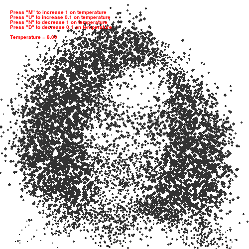
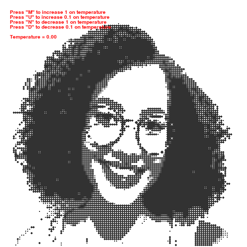

# Pixels Steering Behavior

We will to explore a application of Steering Behaviors (By, Craig Raynolds, 1982). In resume, we call Vehicles any particules that will be a Steering Behavior. Any Vehicles will be a object that atributes are:

- Position
- Velocity
- Acceleration 

We use OpenCv to read image like a np.array, then we use grayscale to determines the radius of each particules in simulation. There is two differents processes on particules: random walker and restoring force. 

- Random walker: if temperature is increase, this process will be more powerful.
- Repulsion: if temperature is decrease, this process will be more powerful.

# Application:

We use a image for this presentation and we use our code to transform some pixels in a Vehicle. 

> The input will be a image below (The most beatiful girl I ever met):


> On high temperature:

<!--  -->

> On low temperature:

<!--  -->

> In the processes, we will see this:


# To Run:

First, clone this repository, enter in your directory and run this comand line:

```terminal
> python ising.py assets/alexia.png
```

You will see the simulation above with image I provide. However, if you want simulate with another image, just use path of the your image instead of "assets/alexia.png" and voi a la! Very much simple.


## Bibliograph:

- CRAIG W. REYNOLDS. 1987. Flocks, herds and schools: A distributed behavioral model. SIGGRAPH Comput. Graph. 21, 4 (July 1987), 25–34. DOI: https://doi.org/10.1145/37402.37406

- CRAIG W. REYNOLDS. Steering Behaviors For Autonomous Characters. Game developers conference. 1999. http://www.red3d.com/cwr/steer/gdc99/

- SHIFFMAN, D. The Nature of Code. Simulating Natural Systems With Processing, 2012. https://natureofcode.com/book/


